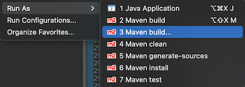
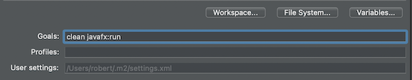
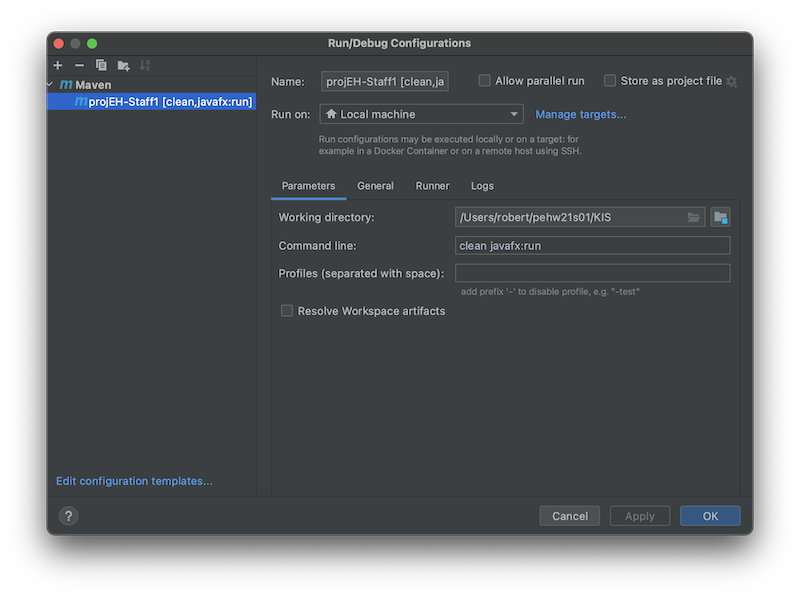
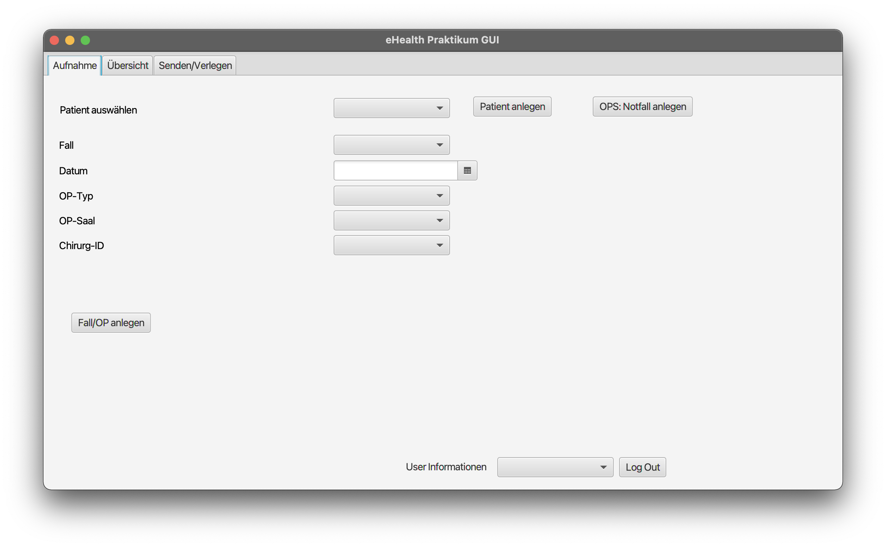
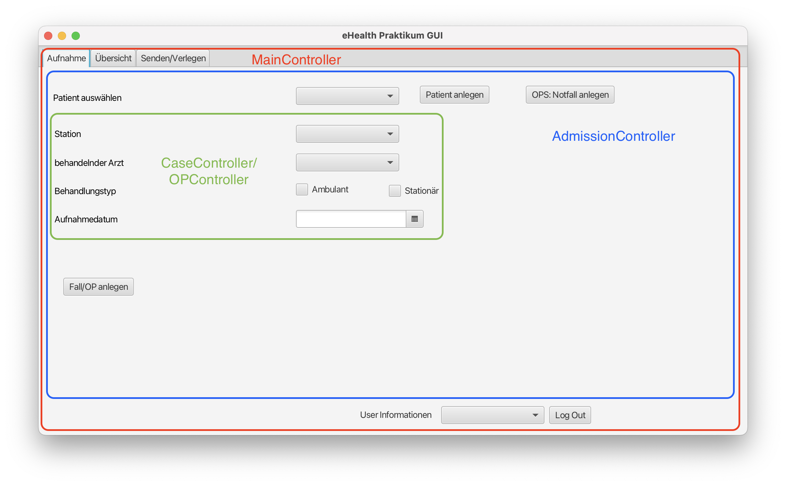
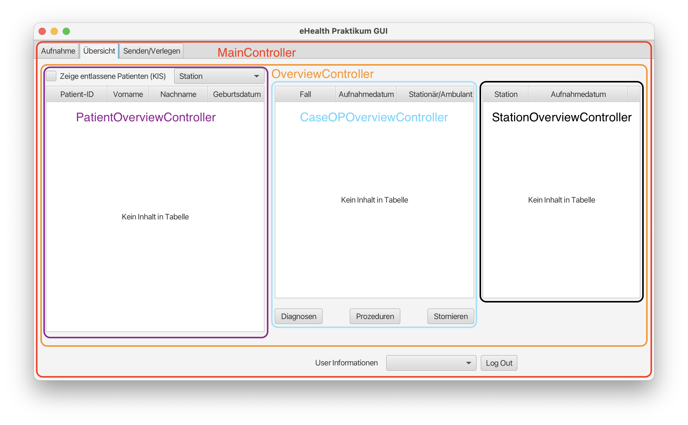
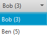
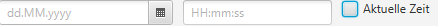
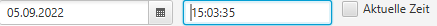
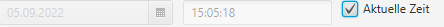

## Wie greife ich auf die Controller-Klassen zu?

Controller, die nicht bereits ineinander verschachtelt sind, können
mittels *Dependency Injection* erreicht werden. D.h. ein Controller bekommt
den anderen als Parameter im Konstruktor und entsprechend passt ihr den
Aufruf mit der `ControllerInjection#load()` Methode and. Mehr dazu findet ihr
weiter unten bei **ControllerInjection** oder im [javafx-jooq Tutorial](../javafx-jooq),
wo das Ganze in einem kompletten Beispiel verwendet wird.

## Wie starte ich das Projekt?

Die folgenden goals (bekannt aus dem SE Praktikum) werden **nicht** benötigt: `compile site`, `test`, `javafx:jlink`

#### Über die Kommandozeile

Im Root-Ordner (mit der pom.xml) `.../pehw21g0x/KIS/` bzw. `.../pehw21g0x/OPS/` folgenden Befehl
ausführen: `mvn clean javafx:run`

#### Über Eclipse

1. Das Projekt selektieren
2. Rechtsklick -> Run As -> Maven Build ... oder über Toolbar
   

3. Bei Goals `clean javafx:run` angeben:
   

Danach ist die Konfiguration über den Pfeil neben `Run` selektierbar

#### Über IntelliJ

Über `Edit configurations` (oben rechts) eine neue **Maven** configuration hinzufügen:


## Was sollte ich sehen wenn das Projekt erfolgreich gestartet wurde?

  

Bitte checkt auch den Output auf der Konsole auf Warnungen und Errors! Prüft zuerst, dass ihr die Vorlage ohne Fehler
starten könnt bevor ihr das Projekt bearbeitet.

## Struktur

Das Template besteht aus mehreren Controllern. Am größten sind die beiden ersten Tabs.

- MainController - Beinhaltet die 3 Tabs und die User Infos unten.
- AdmissionController - Beinhaltet Patientenauswahl und Patientenerstellung sowie Fall/OP Erstellung.
- Case/OPController - Beinhaltet Auswahlfelder für Case/OP.
- PatientController - Wird erstellt, wenn auf "Patient anlegen" gedrückt wird. Beinhaltet die Felder zur
  Erstellung eines Patienten.
- OverviewController - Beinhaltet keine UI Elemente (nur Controller).
- PatientOverviewController - Beinhaltet Stationsauswahl und Patiententabelle.
- CaseOPOverviewController - Beinhaltet Fall-/OPtabelle und Buttons zur Diagnose, Prozedur und zum Stornieren.
- DiagnosisController - Wird erstellt, wenn auf "Diagnosen" gedrückt wird. Beinhaltet Diagnosentabelle
  und Felder zum Hinzufügen einer neuen Diagnose.
- ProcedureController - Wird erstellt, wenn auf "Prozeduren" gedrückt wird. Beinhaltet Prozedurentabelle
  und Felder zum Hinzufügen einer neuen Prozedur.
- StationOverviewController - Beinhaltet eine Tabelle, welche die verschiedenen Stationen,
  die zum ausgewählten Fall gehören, auflistet.
- CommunicationsController - Beinhaltet alle Felder die für die Kommunikation relevant sind.

Der `Admission-Tab` ist folgendermaßen aufgebaut:



Der `Übersicht-Tab` is folgendermaßen aufgebaut:



Die restlichen Controller sind leicht zu verstehen.

## FAQ

<details>
<summary><b>Ich kann das Projekt nicht mit Intellij starten.</b></summary>

Wahrscheinlich erscheint eine Meldung wie "Keine JavaFX-Runtime Komponente verfügbar".

Ladet euch die Java-SDK mit JavaFX herunter, z.B. [Azul Zulu](https://www.azul.com/downloads/?version=java-21-lts&package=jdk-fx#zulu).
Wählt euer Betriebssystem aus und achtet darauf, dass bei Java Package **JDK FX** steht. Speichere diese und wähle sie
in IntelliJ aus. Dafür auf File -> Project Structure -> SDK gehen und die runtergeladene SDK auswählen.

</details>

<details>
<summary>Wenn ich das Programm über IntelliJ starte, bekomme ich beim Öffnen von neuen Fenstern"... does not open to ..."</summary>

Fügt `--add-opens=javafx.graphics/javafx.scene=org.controlsfx.controls` zu den VM-Options bei der Startkonfiguration hinzu.

</details>

<details>
<summary><b>Wie stelle ich die Verbindung mit der Datenbank her?</b></summary>

Einmal beim Start des Programms definieren:
```java
Connection conn = DriverManager.getConnection("url", "name", "password");
DSLContext context = DSL.using(conn, SQLDialect.MARIADB);
Configuration configuration = new DefaultConfiguration().set(conn).set(SQLDialect.MARIADB);
```
Mehr Details findest du im [Einführungstutorial](../jooq-simple/README.md#einstieg-ins-programm).
</details>

<details>
<summary><b>Ich verwende POJO's und DAO's, wie kann ich trotzdem eigene SQL-Anfragen erstellen?</b></summary>

Du kannst einen eigenen DAO schreiben:
```java
public class CustomHaustierDao extends HaustierDao {

    private final DSLContext context;

    public CustomHaustierDao(Configuration configuration, DSLContext context) {
        super(configuration);
        this.context = context;
    }

    public Haustier findByPKs(String spitzname, String besitzer) {
        return context.fetchOne(
                Tables.HAUSTIER,
                Tables.HAUSTIER.SPITZNAME.eq(spitzname).and(Tables.HAUSTIER.BESITZER.eq(besitzer))
        ).into(Haustier.class);
    }
}
```

Mehr Details findest du im [fortgeschrittenen Tutorial](../jooq-advanced/README.md#crinsuinsd---update).
</details>

<details>
<summary><b>Wie zeigt man JOOQ-POJOs in einer Tabelle an?</b></summary>

```java
@FXML
private TableColumn<Patient, String> patFirstName;
//...
// "firstname" is the colum name in the DB
patFirstName.setCellValueFactory(new PropertyValueFactory<>("firstname"));
```
Bei Strings, Ints, etc. funktioniert die Anzeige einwandfrei, aber bei manchen Datentypen kann ein Mapping hilfreich sein,
z.B. wenn ein Datum besonders formatiert werden soll. Dafür gibt es eine `DBTableColumn` Klasse für das Praktikum.

```java
import javafx.fxml.FXML;
import util.DBTableColumn;

import java.time.LocalDate;
import java.time.format.DateTimeFormatter;

@FXML
private DBTableColumn<Patient, LocalDate> patGebDat; // ✅ also change in FXML file

setCellValueFactory(new PropertyValueFactory<>("gebDat"));
// setText(...) only available in DBTableColumn
setText(localDate -> localDate.format(DateTimeFormatter.ofPattern("yyyy.MM.dd")));
```

</details>

<details>
<summary><b>Wie zeigt man JOOQ-POJOs in einem Dropdown (ComboBox) an?</b></summary>

Es gibt im Rahmen des Praktikums eine eigene `DBComboBox`Klasse. Diese kann als Drop-in Ersatz statt der normalen
JavaFX `Combobox` verwendet werden.
Aus

```java
ComboBox<Patient> patientDropdown;
```

```fxml
<ComboBox fx:id="patientDropdown" />
```

wird

```java
DBComboBox<Patient> patientDropdown;
```

```fxml
<DBComboBox fx:id="patientDropdown" />
```

Jetzt gibt es eine zusätzliche Methode

```java
// do once (i.e. in initialize())
patientDropdown.setText(patient -> "%s %s (%s)".format(patient.vorname(), patient.nachname(), patient.alter()))
```

Ausgewählte Elemente können jetzt direkt per Objekt (statt String) geholt werden.

```java
Patient selectedPatient = patientDropdown.getValue()
// bzw. per event
patientDropdown.valueProperty().addListener((observableValue, oldPatient, newPatient) -> {
   // old and new patients are of type "Patient"
})
```

</details>

<details>
<summary><b>Ich verwende die Sonderklassen, jetzt kann ich die Dateien aber nicht mehr im SceneBuilder öffnen.</b></summary>

Führt `mvn clean package` aus. Jetzt wird im `target/<\project_name\>.jar` eine Datei erstellt. Diese kann im
SceneBuilder importiert werden. Dafür müsst ihr irgendeine (gültige) FXML Datei öffnen und dann oben links auf dem
Zahnrad klicken und "JAR/FXML Manager" auswählen. Dann "Add Library/FXML from file system" auswählen und die Klassen
anklicken. Jetzt sollten FXML Dateien einwandfrei funktionieren.
</details>

<details>
<summary><b>Im SceneBuilder sehen die Styles anders aus als im Programm.</b></summary>

Die Funktionalität wird durch die Unterschiede nicht beeinflusst, dennoch kann es hilfreich sein im SceneBuilder die
exakt gleiche Anzeige zu haben. Lade dafür zunächst die [SceneBuilder Themes Zip](https://github.com/mkpaz/atlantafx/releases)
runter und speichere sie in `%HOMEPATH%/Local/SceneBuilder/app/`. Zusätzlich musst du in der `SceneBuilder.cfg`
`app.classpath=$APPDIR\AtlantaFX-${atlanta_version}-scenebuilder.zip:$APPDIR\scenebuilder-${scenebuilder_version}-all.jar`
ergänzen. Als Nächstes öffnest du die Zip und navigierst so lange, bis du `.css` Dateien findest. Diese musst du extrahieren und irgendwo
speichern. Wenn du jetzt den SceneBuilder mit einer FXLM Datei öffnest, dann kannst du unter Preview -> Themes dein Theme
auswählen. Eine *Übersetzung* der Namen findest du [hier (ganz unten)](https://mkpaz.github.io/atlantafx/fxml/). Damit
Stylesheets richtig angezeigt und Auto-Completion haben, musst du unter Preview ->
Scene Style Sheets -> Add a Style Sheet... eine der extrahierten`.css` Dateien auswählen, z.B. `primer-light.css`.


</details>

<details>
<summary><b>Ich möchte von Controller A auf Controller B zugreifen.</b></summary>

Hierfür ein konkretes Beispiel aus dem template: Ihr möchtet Zugriff auf den `PatientOverviewController` von
dem `CaseOPOverviewController` haben, um nur Fälle des ausgewählten Patienten anzuzeigen. Wir gehen davon aus, dass ihr
bereits eine `getSelectedPatientID()` im `PatientOverviewController` habt. Als erstes passt ihr die Konstruktor Aufrufe
in der `Main` Klasse an (oder da, wo ihr die Hauptanwendung ladet).

```java
// Main Class
@Override
public void init() throws Exception {
    // ✅ create one instance of the controller you want to share
    PatientOverviewController patientOverviewController = new PatientOverviewController();
    root = ControllerInjection.load("/fxml/MainForm.fxml",
            Map.of(
                    MainController.class, () -> new MainController(),

                    AdmissionController.class, () -> new AdmissionController(),
                    CaseController.class, () -> new CaseController(),
                    OPController.class, () -> new OPController(),

                    OverviewController.class, () -> new OverviewController(),
                    PatientOverviewController.class, () -> patientOverviewController, // ✅ use shared controller
                    CaseOPOverviewController.class, () -> new CaseOPOverviewController(patientOverviewController), // ✅ supply shared controller to other controller
                    StationOverviewController.class, () -> new StationOverviewController(),

                    CommunicationsController.class, () -> new CommunicationsController()
            )
    );
}

// CaseOpOverviewController Class
private final PatientOverviewController patientOverviewController;

public CaseOPOverviewController(PatientOverviewController patientOverviewController) {
    this.patientOverviewController = patientOverviewController;
}

public void showCasesForPatient() {
   int patID = patientOverviewController.getPatientID();
   // do something with the patID
}

```

Natürlich ist das nur ein Beispiel, ihr könnt das nach Belieben umändern/anders gestalten.

</details>

<details>
<summary><b>Ich verwende den FXMLLoader und jetzt geht gar nichts mehr.</b></summary>

FXML Dateien und deren Controller dürfen nur mit der bereitgestellten `ControllerInjection#load` Methoden geladen werden,
sonst funktioniert nichts mehr.

```java
FXMLLoader.load(...) // ❌

ControllerInjection.load(...) // ✅
```
</details>

<details>
<summary><b>Ich erstelle neue Controller Instanzen außerhalb der load Methode.</b></summary>

Es ist wichtig, dass die gleichen Controller übergeben werden. Wenn du folgendes (o.Ä.) im Programm hast:
```java
public class AController {
  private final SomeController someController = new SomeController(); // ❌
}
```
Dann ist das wahrscheinlich nicht so gewollt. Wahrscheinlich möchtest du Zugriff auf `SomeController` von `AController`
haben. Dafür musst die Controller-Injektion verwenden.

```java
import util.ControllerInjection;

import java.util.Map;

public class AController {
  private final SomeController someController;

  public AController(SomeController someController) {
    this.someController = someController; // ✅
  }
}
// somewhere else where the FXML file for AController is loaded
ControllerInjection.load("aPath", Map.of(
    SomeController.class, () -> someController // if the loading happens inside 'SomeController', use 'this'
));
```
</details>

### Refreshable

Es ist insgesamt leichter nach einer Änderung der Datenbank,
die gesamte UI zu der Tabelle neu zu laden. Dabei soll dieses Interface
eine gemeinsame Abstraktionsebene darstellen.
**Hinweis**: Dieses Interface ist nur ein Angebot, es muss nicht verwendet werden.

### EditController

In der GUI muss oft zwischen UI-Feldern und Modellobjekten umgewandelt werden.
Dieses Interface soll die Interaktion vereinheitlichen.
**Hinweis**: Dieses Interface ist nur ein Angebot, es muss nicht verwendet werden.

## Utility Klassen

Die folgenden Klassen sind eine Reihe von Utility Klassen, die das Arbeiten im Praktikum erleichtern sollen.
Bis auf `ControllerInjection` müssen die Klassen nicht verwendet werden und sind nur ein Angebot.
Sämtliche Klassen können nach Bedarf individuell angepasst werden.

### ControllerInjection

Im Praktikum wird euch die Möglichkeit bereitgestellt, FXML zusammen mit eigenen Controller Konstruktoren zu verwenden.
Controller deren Konstruktor während des Lebenszyklus der Applikation nicht ändern, können einmal global zum
Programmstart
gesetzt werden.

```java
ControllerInjection.addInjectionMethod(Controller.class, () -> new Controller(...));
```

Wenn jetzt in irgendeiner FXML Datei bei `fx:controller` dieser Controller angegeben ist, wird statt dem leeren
Konstruktor
der angegebene Konstruktor aufgerufen. Das gilt auch bei Verschachtelungen mit `fx:include`.
Geladen werden kann eine FXML Datei dann mit `ControllerInjection.load("path/to/fxml_file.fxml")`

Controller, deren Instanziierung dynamisch von Variablen abhängt, können lokal gesetzt werden. Dafür kann während
dem Laden der Datei über `ControllerInjection.load()` der Controller direkt mit angegeben werden.

Wichtig ist hierbei, dass ihr das typische Laden von FXML mittels eines `FXMLoaders` nicht selber macht, sondern
ausschließlich FXML-Dateien über die [ControllerInjection](./src/main/java/util/ControllerInjection.java) Klasse ladet.

Es lohnt sich das Ganze in Action hier im template oder im [javafx-jooq Tutorial](../javafx-jooq) anzuschauen.

### AutoCompleteTextField

Gerade bei größeren Auswahlmöglichkeiten kann eine Auto-Completion hilfreich sein, dafür gibt es die `AutoCompleteTextField`
Klasse. Ihr erstellt ein `Set` mit möglichen Elementen und setzt einen Display-String zur Anzeige.
```java
private record Patient(String vorname, String nachname, int id) {} // dummy data class

SortedSet<Patient> patientSet = new TreeSet<>(Comparator.comparingInt(o -> o.id()));
patientSet.add(new Patient("Gustav", "Gans", 1));
patientSet.add(new Patient("Dagobert", "Duck", 2));
patientSet.add(new Patient("Donald", "Duck", 3));

patientAutoCompleteTextField.setEntries(patientSet);
patientAutoCompleteTextField.setText(patient -> "%s %s (%s)".formatted(patient.vorname(), patient.nachname(), patient.id()));
```
Ihr könnt die Klasse auch in FXML verwenden.
```fxml
<AutoCompleteTextField fx:id="yourFXID" />
```

### DBComboBox

Diese Art von `ComboBox` erlaubt eine einfache visuelle Anzeige des Modellobjekts in der ComboBox.
Jegliche Interaktion im Code mit der ComboBox geschieht mit dem Modellobjekt, also hier `Haustier`.
Z.B. das aktuell ausgewählte Item ist auch von dem Typ, während der User nur die visuelle Anzeige sieht.

```java
Haustier selected = dbComboBox.getSelectionModel().getSelectedItem();
```

Erstellung in Java Code:

```java
DBComboBox<Haustier> dbComboBox = new DBComboBox<>(haustier -> haustier.getSpitzname() + " (" + haustier.getAlter() + ")");
```

Erstellung in FXML:

```xml
<DBComboBox fx:id="dbComboBox" fx:value="org.example.Haustier -> spitzname (alter)"/>
```

In der GUI:



Um die genaue Syntax für `fx:value` zu verstehen, lohnt sich ein Blick in die
[Javadoc](src/main/java/util/DBComboBox.java) von der `valueof` Methode.
JavaFX gibt den String, der bei `fx:value` angegeben wird an diese Methode weiter.

Es ist zu beachten, dass eine konkrete `DBComboBox` nur über einen Weg erstellt werden darf.
Also entweder nur im Java Code und sie kommt gar nicht in FXML vor, oder nur über FXML
und dann darf im Java Code aber nicht mehr `dbComboBox = new DBComboBox<>(...)` stehen.
Sowas wie Items setzen o.Ä. geht natürlich weiterhin, die Instanz darf nur nicht mit einer
neuen überschrieben werden.

### DateUtil

Enthält einige Konstanten für Date-Pattern (die bei Bedarf auch gerne pro Gruppe angepasst werden dürfen), weil ihr doch
an den verschiedensten Stellen Datum/Uhrzeiten von User erwartet.

Darüber hinaus kann mit der `link` Methode aus 3 einzelnen JavaFX Objekten ein zusammenhängendes Objekt erstellt werden,
welches Datum und Uhrzeit beinhaltet. Oftmals werdet ihr Datum und Uhrzeit vom User gleichzeit benötigen und diese
Klasse
soll das vereinfachen. Noch einfacher geht es aber, wenn ihr direkt einen
[DateTimeSelector](src/main/java/org/example/util/DateTimeSelector.java) verwendet. Intern verwendet dieser auch diese
`DateUtil` Klasse.

### DateTimeSelector

Vereint einen DatePicker, ein TextField und eine CheckBox in einer HBox.
Dabei ist...

- der DatePicker zuständig für das Datum
- das TextField zuständig für die Uhrzeit
- die CheckBox eine Option die Zeit (Datum und Uhrzeit) auf _jetzt_ zu setzen, wenn markiert

Erstellung in Java Code:

```java
DateTimeSelector dateTimeSelector = new DateTimeSelector(datePattern, timePattern);
```

Erstellung in FXML:

```xml

<DateTimeSelector datePattern="dd.MM.yyyy" timePattern="HH:mm:ss"/>
```

In der GUI:







Die Klasse speichert die Informationen zusammen in einem `LocalDateTime`.

Es sind einige Regeln festgelegt:

- Wenn der Nutzer ein Datum und eine Uhrzeit ausgewählt hat, dann besteht das `LocalDateTime` aus den beiden Feldern.
- Wenn der Nutzer ein Datum ausgewählt hat, aber noch keine Uhrzeit, dann besteht das `LocalDateTime` aus dem gewählten
  Datum und
  der _jetzigen_ Uhrzeit.
- Wenn der Nutzer eine Uhrzeit ausgewählt hat, aber noch kein Datum, dann besteht das `LocalDateTime` aus der gewählten
  Uhrzeit und
  dem _heutigen_ Datum.
- Wenn die `CheckBox` selektiert wird, dann wird der Input für die anderen beiden Felder deaktiviert und
  das `LocalDateTime` auf _jetzt_ gesetzt.
- Wenn die `CheckBox` deselektiert wird, dann wird der Input für die anderen beiden Felder aktiviert und
  das `LocalDateTime` geleert.

### CompleteDatePicker

Kombiniert das TextField beim DatePicker mit dem eigentlichen DatePicker selber. Das normale Verhalten
eines `DatePickers` ist,
dass wenn ein syntaktisch korrektes Datum im TextField des DatePickers eingegeben wird, das Modellobjekt intern,
also das was `datePicker.getValue()` zurückgibt, nicht auf das geschriebene Datum gesetzt wird.

Ebenfalls wird festgelegt, wie ein über den DatePicker ausgewähltes Datum in dem dazugehörigen Textfield angezeigt wird.

Erstellung in Java Code:

```java
CompleteDatePicker datePicker = new CompleteDatePicker(datePattern);
```

Erstellung in FXML:

```xml
<CompleteDatePicker pattern="dd.MM.yyyy"/>
```

Visuell sieht es aus wie ein gewöhnlicher DatePicker.

### JavaFX Utility Klassen im SceneBuilder

Ihr könnt die Utility Klassen auch im Scene Builder verwenden. Dafür müsst ihr einmalig
mit `mvn package` eine `.jar` des Templates generieren und diese im
SceneBuilder importieren. Anschließend stehen die Klassen genauso wie normale Klassen
zur Auswahl verfügbar. Aber z.B. eigene FXML-Attribute, wie z.B. der
lambda-ähnliche Ausdruck bei der `DBComboBox` sind über den SceneBuilder nicht unterstützt.
Dafür muss man nach der Bearbeitung im SceneBuilder in die generierte FXMl Datei gehen und
das manuell ergänzen.
